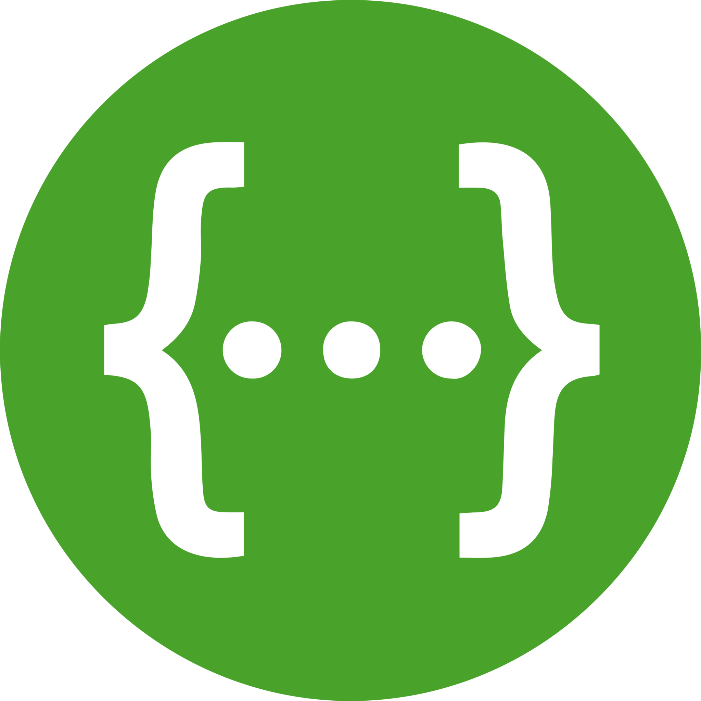
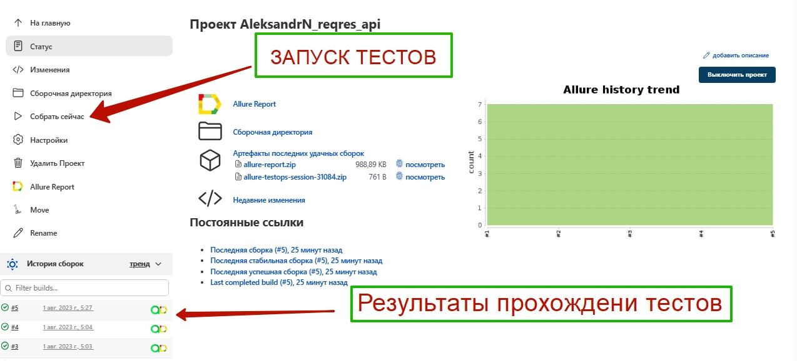
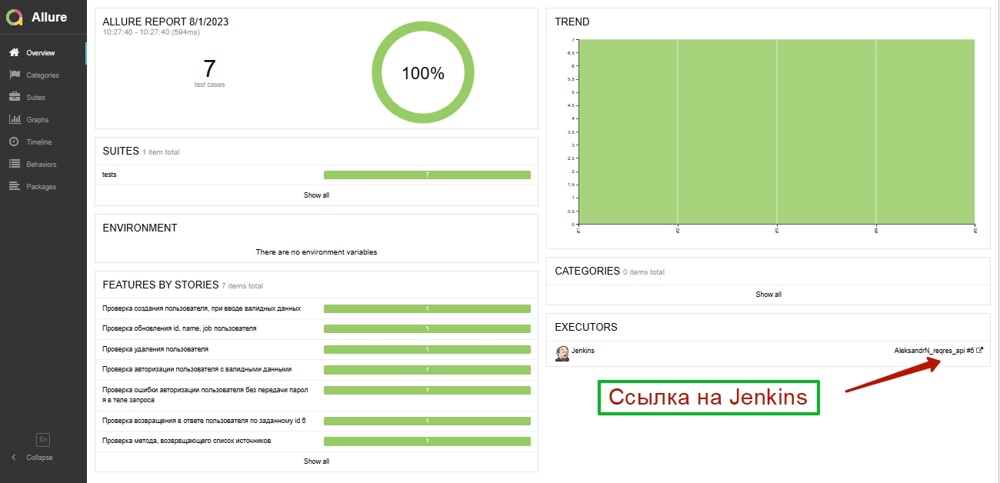
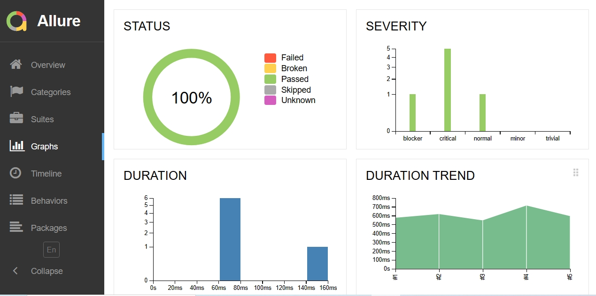
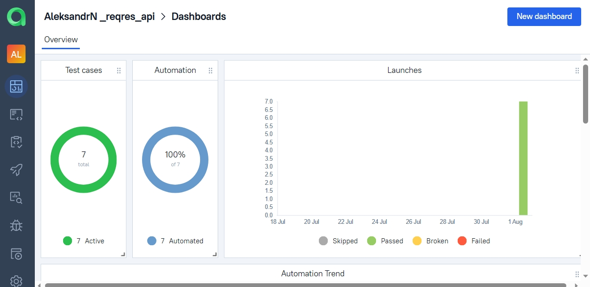
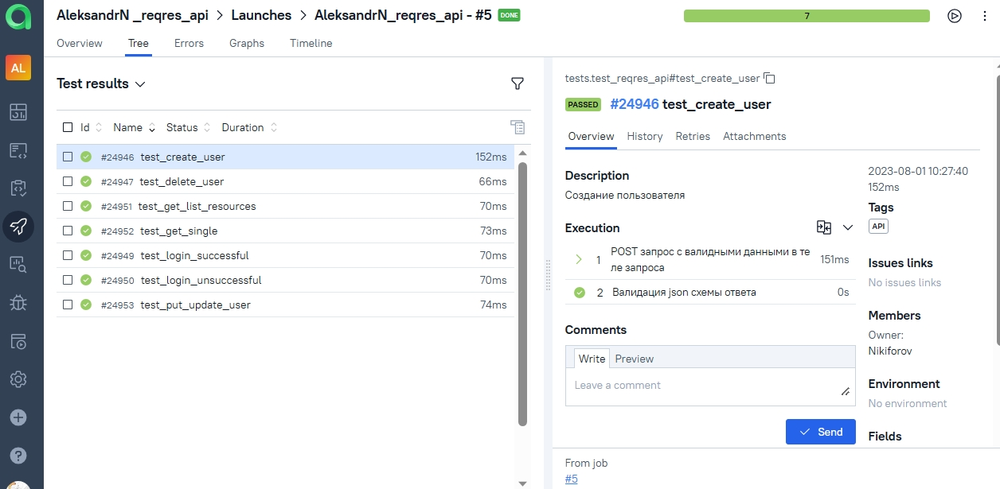
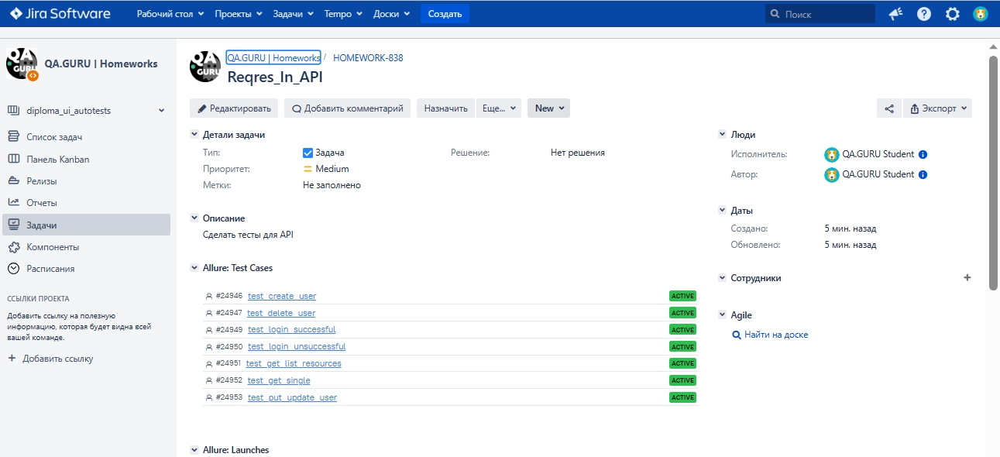

# Дипломный проект по тестированию API [reqres.in](https://reqres.in/)

  

## Реализованные проверки по тест-кейсам  
✓ Запрос списка источников(ресурсов)  
✓ Авторизация пользователя с валидными данными 
✓ Получаение пользователя по переданному id  
✓ Обновление данных пользователя по его id 
✓ Удаление пользователя  
✓ Ошибка авторизации с пустым обязательным полем password
✓ Регистрация пользователя с валидными данными

## Используемый стек

<code></code>
<code></code>
<code></code>
<code></code>
<code></code>
<code></code>
<code></code>
<code></code>
<code></code>
<code></code>

## Сборка в Jenkins
[JOB](https://jenkins.autotests.cloud/job/AleksandrN_reqres_api/)

  

## Allure report
[Ссылка на отчет](https://jenkins.autotests.cloud/job/Students/job/Requests_API/allure/)
##### После прохождения тестов, результаты можно посмотреть в Allure отчете, где так же содержится ссылка на Jenkins.

  

##### Во вкладке Graphs можно посмотреть графики о прохождении тестов, по их приоритезации, по времени прохождения и др.

  

<!-- Allure TestOps -->

###  Интеграция с Allure TestOps
### [Dashboard](https://allure.autotests.cloud/project/3599/dashboards)
##### Так же вся отчетность сохраняется в Allure TestOps, где строятся аналогичные графики.

#### Во вкладке со сьютами, мы можем:
- Управлять всеми тест-кейсами или с каждым отдельно
- Перезапускать каждый тест отдельно от всех тестов
- Настроить интеграцию с Jira
- Добавлять ручные тесты и т.д

<!-- Jira -->

###  Интеграция с Jira
##### Настроив через Allure TestOps интеграцию с Jira, в тикет можно передать результат прохождение тестов и список тест-кейсов из Allure

